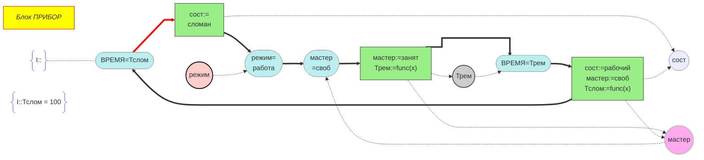
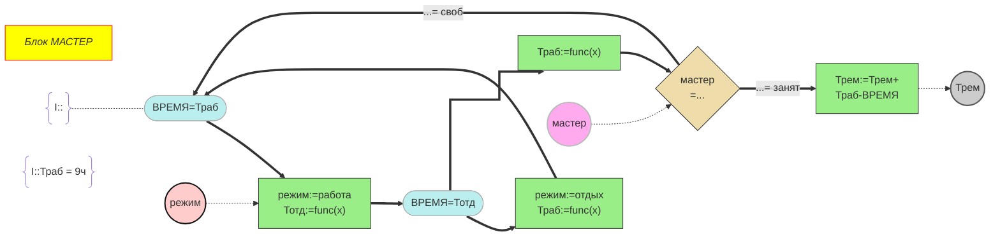
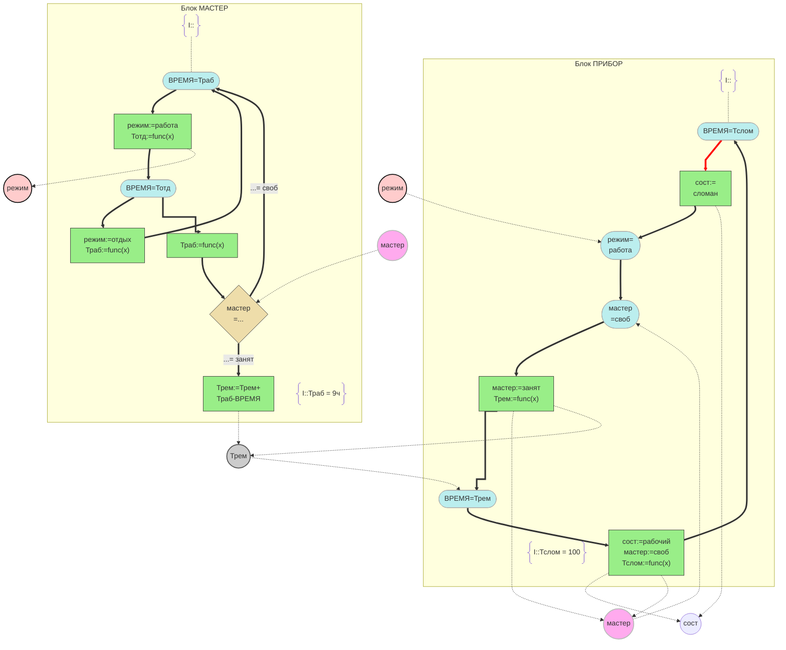

# Операторно-параметрические схемы модели "Прибор-Мастер"

## Трек ПРИБОР

```mermaid
flowchart LR
  title[<em>Блок ПРИБОР</em>]
  h1(["ВРЕМЯ=Тслом"]) e10@==> h2["сост:=<br>сломан"]
  h2 e11@==> h3(["режим=<br>работа"])
  h3 ==> h4(["мастер<br>=своб"])
  h4 ==> h5["мастер:=занят<br>Трем:=func(x)"]
  h5 e20@==> h6(["ВРЕМЯ=Трем"])
  h6 ==> h7["сост:=рабочий<br>мастер:=своб<br>Тслом:=func(x)"]
  h7 ==> h1

  h2 -.->par3((сост))
  h7 -.->par3
  par1((режим))-.->h3
  par2((мастер))-.->h4
  h5 -.->par2
  h7 -.->par2
  h5 -.->par4((Трем))
  par4 -.-> h6

  Ini@{shape: braces, label: "I::"} -.- h1
  HTf@{shape: braces, label: "I::Тслом = 100"}

  e10@{ curve: linear}
  e11@{ curve: natural}
  e20@{ curve: stepAfter}

  classDef cond fill:#bee,stroke:#aaa,stroke-width:1px;
  classDef state fill:#9e8,stroke:#333,stroke-width:1px;
  class h5,h2,h7 state;
  class h1,h3,h4,h6 cond;
  style title fill:yellow,stroke:red;
  style par1 fill:#fcc,stroke:#111,stroke-width:2px;
  style par2 fill:#fae,stroke:#bbb,stroke-width:2px;
  style par4 fill:#ccc,stroke:#555,stroke-width:2px;
  linkStyle 0 stroke:red,stroke-width:4px;

  click par2 href "https://iu5.bmstu.ru" "переход для Мастера" _blank
  click par4 href "https://iu5.bmstu.ru" "параметр Трем" _blank
```

---

## Трек МАСТЕР

```mermaid
flowchart LR
  title2[<em>Блок МАСТЕР</em>]
  h11(["ВРЕМЯ=Траб"]) ==> h12["режим:=работа<br>Тотд:=func(x)"]
  h12 ==> h13(["ВРЕМЯ=Тотд"])
  h13 ==> h14["режим:=отдых<br>Траб:=func(x)"]
  h14 ==> h11

  h13 e30@==> h17["Траб:=func(x)"]
  h17 ==> h15{"мастер<br>=..."}
  h15 ==>|"...= занят"| h16["Трем:=Трем+<br>Траб-ВРЕМЯ"]
  h15 ==>|"...= своб"| h11

  h16 -.->par4b((Трем))
  par2b((мастер))-.->h15
  par1b((режим))-.->h12

  Ini2@{shape: braces, label: "I::"} -.- h11
  HTf2@{shape: braces, label: "I::Траб = 9ч"}

  e30@{ curve: stepBefore}

  classDef cond fill:#bee,stroke:#aaa,stroke-width:1px;
  classDef state fill:#9e8,stroke:#333,stroke-width:1px;
  classDef navig fill:#eda,stroke:#333,stroke-width:1px;
  class h12,h14,h16,h17 state;
  class h11,h13 cond;
  class h15 navig;
  style title2 fill:yellow,stroke:red;
  style par1b fill:#fcc,stroke:#111,stroke-width:2px;
  style par2b fill:#fae,stroke:#bbb,stroke-width:2px;
  style par4b fill:#ccc,stroke:#555,stroke-width:2px;

  click par2b href "https://iu5.bmstu.ru" "переход для Мастера" _blank
  click par4b href "https://iu5.bmstu.ru" "параметр Трем" _blank
```

---

## Объединённая ОПС "Ремонт Прибора" (Прибор + Мастер)

```mermaid
flowchart TD

  subgraph ПРИБОР["Блок ПРИБОР"]
    direction TB
    h1(["ВРЕМЯ=Тслом"]) e10@==> h2["сост:=<br>сломан"]
    h2 e11@==> h3(["режим=<br>работа"])
    h3 ==> h4(["мастер<br>=своб"])
    h4 ==> h5["мастер:=занят<br>Трем:=func(x)"]
    h5 e20@==> h6(["ВРЕМЯ=Трем"])
    h6 ==> h7["сост:=рабочий<br>мастер:=своб<br>Тслом:=func(x)"]
    h7 ==> h1
    Ini@{shape: braces, label: "I::"} -.- h1
    HTf@{shape: braces, label: "I::Тслом = 100"}
  end

  subgraph МАСТЕР["Блок МАСТЕР"]
    direction TB
    h11(["ВРЕМЯ=Траб"]) ==> h12["режим:=работа<br>Тотд:=func(x)"]
    h12 ==> h13(["ВРЕМЯ=Тотд"])
    h13 ==> h14["режим:=отдых<br>Траб:=func(x)"]
    h14 ==> h11
    h13 e30@==> h17["Траб:=func(x)"]
    h17 ==> h15{"мастер<br>=..."}
    h15 ==>|"...= занят"| h16["Трем:=Трем+<br>Траб-ВРЕМЯ"]
    h15 ==>|"...= своб"| h11
    Ini2@{shape: braces, label: "I::"} -.- h11
    HTf2@{shape: braces, label: "I::Траб = 9ч"}
  end

  %% общие параметры
  h2 -.->par3((сост))
  h7 -.->par3
  par1((режим))-.->h3
  par2((мастер))-.->h4
  h5 -.->par2
  h7 -.->par2
  h5 -.->par4((Трем))
  par4 -.-> h6
  h16 -.->par4
  par2b((мастер))-.->h15
  h12 -.->par1b((режим))

  e10@{ curve: linear}
  e11@{ curve: natural}
  e20@{ curve: stepAfter}
  e30@{ curve: stepBefore}

  classDef cond fill:#bee,stroke:#aaa,stroke-width:1px;
  classDef state fill:#9e8,stroke:#333,stroke-width:1px;
  classDef navig fill:#eda,stroke:#333,stroke-width:1px;
  class h5,h2,h7,h12,h14,h16,h17 state;
  class h1,h3,h4,h6,h11,h13 cond;
  class h15 navig;
  style par1 fill:#fcc,stroke:#111,stroke-width:2px;
  style par2 fill:#fae,stroke:#bbb,stroke-width:2px;
  style par4 fill:#ccc,stroke:#555,stroke-width:2px;
  style par1b fill:#fcc,stroke:#111,stroke-width:2px;
  style par2b fill:#fae,stroke:#bbb,stroke-width:2px;
  linkStyle 0 stroke:red,stroke-width:4px;

  click par2 href "https://iu5.bmstu.ru" "переход для Мастера" _blank
  click par4 href "https://iu5.bmstu.ru" "параметр Трем" _blank
  click par2b href "https://iu5.bmstu.ru" "переход для Мастера" _blank
```
