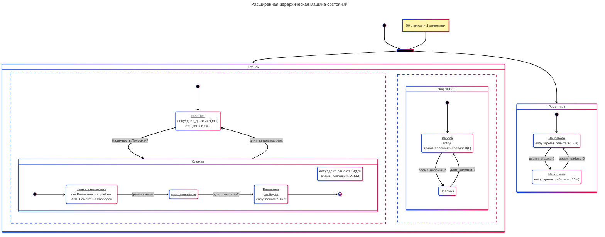
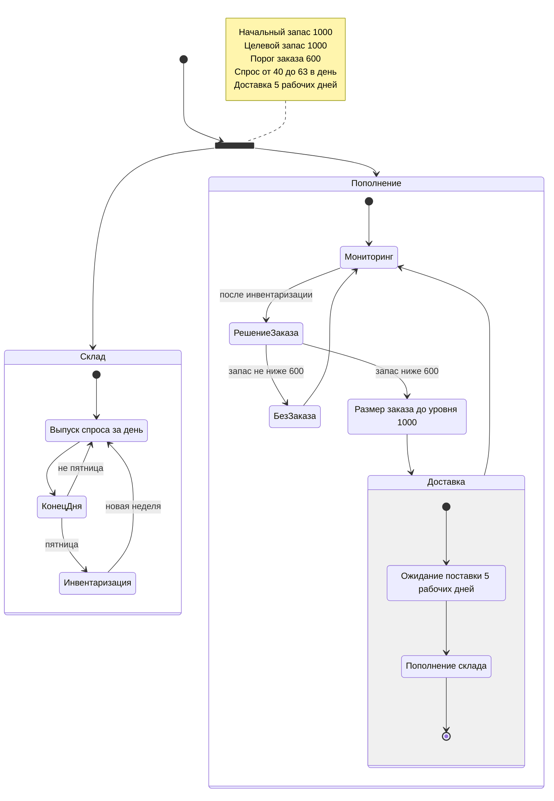

```mermaid
---
title: Расширенная иерархическая машина состояний
config:
  theme: neo
  look: neo
---
stateDiagram-v2
direction TB

state maintain <<fork>>
[*] --> maintain
maintain --> Станок
maintain --> Ремонтник

note left of maintain
50 станков и 1 ремонтник
end note

state Станок {
  working: <u>Работает</u><br/>entry/ длит_детали=N(m,s)<br/>exit/ детали += 1
  failed: <u>Сломан</u>

  [*] --> working
  working --> failed : Надежность.Поломка-?
  failed --> working : длит_детали коррект.

  --

  state Надежность {
    work: <u>Работа</u><br/>entry/ время_поломки=Exponential(L)
    [*] --> work
    work --> Поломка : время_поломки ?
    Поломка --> work : длит_ремонта-?
  }
}

state Ремонтник {
  startwork: <u>На_работе</u><br/>entry/ время_отдыха += 8(ч)
  endwork: <u>На_отдыхе</u><br/>entry/ время_работы += 16(ч)

  [*] --> startwork
  startwork --> endwork : время_отдыха-?
  endwork --> startwork : время_работы-?
}

state failed {
  ent: entry/ длит_ремонта=N(f,d)<br/>время_поломки=ВРЕМЯ
  request_fixer: <u>запрос ремонтника</u><br/>do/ Ремонтник.На_работе AND Ремонтник.Свободен
  wait_repair: <u>восстановление</u>
  release_fixer: <u>Ремонтник<br/>свободен</u><br/>entry/ поломка += 1

  direction LR
  [*] --> request_fixer
  request_fixer --> wait_repair : [ремонт начат]
  wait_repair --> release_fixer : [длит_ремонта-?]
  release_fixer --> [*]
}
```

```mermaid
stateDiagram-v2
direction TB

state start <<fork>>
[*] --> start
start --> Склад
start --> Пополнение

note left of start
Начальный запас 1000
Целевой запас 1000
Порог заказа 600
Спрос от 40 до 63 в день
Доставка 5 рабочих дней
end note

state Склад {
  [*] --> РабочийДень
  РабочийДень : Выпуск спроса за день
  РабочийДень --> КонецДня

  КонецДня --> РабочийДень : не пятница
  КонецДня --> Инвентаризация : пятница
  Инвентаризация --> РабочийДень : новая неделя
}

state Пополнение {
  [*] --> Мониторинг
  Мониторинг --> РешениеЗаказа : после инвентаризации

  state РешениеЗаказа <<choice>>
  РешениеЗаказа --> БезЗаказа : запас не ниже 600
  РешениеЗаказа --> ФормироватьЗаказ : запас ниже 600

  БезЗаказа --> Мониторинг

  ФормироватьЗаказ : Размер заказа до уровня 1000
  ФормироватьЗаказ --> Доставка

  state Доставка {
    [*] --> Ожидание
    Ожидание : Ожидание поставки 5 рабочих дней
    Ожидание --> ПриходПоставки
    ПриходПоставки : Пополнение склада
    ПриходПоставки --> [*]
  }

  Доставка --> Мониторинг
}
```
